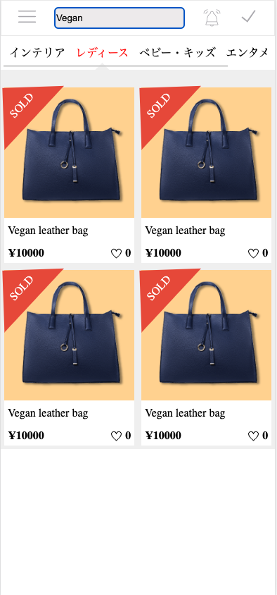

# Developmnt Process

Below are some ideal steps I would have followed in order to complete application development start from requirment gathering and till it deployed to PROD. as this is skill test and I have limitation of time as well so i have focus on some of the areas which are required in order to complete the skill test. (will mention below in detail..)

* __Requirement Understanding__
    * Analyse the mock/wireframe 
    * Verified the I/F available and its Data Strcuture

* __Development__
    * Choosing Foundation Frameworks
    * Setting Up Framework Foundations
    * Build Tool(WebPack)
    * Development Env
        * Adding Required Frameworks for building this assignment
    * Deciding The Folder Structure
    * Componentization: Breakdown the mock up into small re-usable components
    * Building Small Components 
    * Writing the snapshot test 
    * Identify the Component States and Compose The Page UI with Small Component 
    * Integrate Page with Router
    * Choosing The Way For Fetching the data and Managing the application State 

* __Testing__
    * Writing Integration Tests for Main Pages
    * Checking and verifying the Application Manually Improve the UX
    * Check The Browser Compatibility
    * Maintain the issues logs and fix it on basis of priority based on the availabel time
* __Performance__
    * Performance Ananlysis
    * Test Application with slow 3G by adding throttling in network
    * Fix The Performance Issues
* __Security__
    * Verify the Applicatino From Security Point of view 
        * User Authentication
        * Preventing Cross Site Scripting atacks
        * Safe Dynamic Content Rendering
        * Code Injection
* __Documentation__
    * Document the Architecture
    * Coding Standards .etc
* __PROD Deployment__ 
    * Prod Log Monitoring and Analysis
    * Identify the potential errors and fix next release or hot fixes if urgent


# Requirement Understanding
 For Requirement Understanding of this skill test, I have gone throw the skill test issue on gihub, checked instruction provided on the skilltest.md. I have also reviewed the provided mock for application and verified the I/F as well. I has some questions regarding the mock, requirement and I/F, which posted git [issue](https://github.com/m-rec/test-for-mp-frontend-ashishghumnar/issues/2).

# Development
As we need build the skill test from the scratch, so we will be choosing TypeScript as our language.  React as Framework for building the UI components, 
SWR as React Hook For Data Fetching From Server.
## Development Foundations
For Building up the Development Foundatino we will be using the following language, framework and tools 
### TypeScript:
*  For Buildng the Development Foundation we will use TypeScript as our based language as TypeScript offers more strict type
checking and it will help us avoid the potential issue as run time as TypeScript will help to identify at early state.

### React:
* For Building the UI Components we will use React as React offers great features like Creating Functional Component, Hooks, Optimized DOM rendering which will help to improve the application peroformance. aslo its easy to scale application with React.
### React Router:
* React Router will help us configure the application routes and load the pages resources (bundle) dynamically, it will also providing some react hooks and components which will help managing/handling the application routes, queryparams.
### SWR:
* SWR provide React hooks for data fetching and allowing to cache data an avoid the request deduplication which will help us to improve the performance. SWR will help us build the non blocking UIs as we can load the data for the component withing the same component and it will also help holding the main component to render till complete data is not loaded and show the loader etc.

### Jest: 
* Jest will be used as test runner for our automation test 
* we will be using it for generating snapshot test as well, as snapshot test will help us identify the changes in component during the reviewing the PR and can identify the potential error or unexpected changes as early stage.

### React Testing Library: 
* We will be using writing UI component automated test cases. (Integration test)
For Skill Test pupose i have automated only main page component scenario (it will cover the child component as well but test code will be written on main page)

### WebPack:
* We will be using the webpack as module bundler, and manages the dependancy graph of our application resources efficiently
 please check the webpack confirm for detail about the loaders and configuration used, for skill test purpose i have used only development mode and build will not be that optimised. it will affect the first rendering and performance of the app but due to time constrain i will consider this as low priority over building the other features.

### Hygen: 
* Hygen will used as code generator tool, we will be using to generate our functional component with it


# Deciding The Folder Structure
* By considering this as small application i have kept simple but scalable folder structure by considering this as single application but when we will have larger project with different small application and some shared UI component this folder strcture will not be efficient

```
project
│   README.md
│   webpack.config
|   jest.config.ts
|   ...proect configuration    
│
|___src/
│   │____/app
|   |____/components: -->for shared components within the aplication like Input, Button etc
│   │____/constants: -->for constants to declared (i havnt got chance to create it)
│   │____/hooks
|   |__________/fetchAPI: -->for keeping the data fetching hooks 
│   |__________/utils/ -->for other hooks
│   |____/pages/.. -->here we will be keeping all the application main pages
|   |____/pages/components  --> page specific components
|   |____/pages/__test__  --> for coponent test
│   |____/routes/
│   |____/utils/ --> general page level utility fuctions 
│   
```

### Componentization:
Here I tried to break down and identify the possible components

 ** please note component names might have be changed at the time of development 

*****--Sorry SKIPPING Some Part due to time constrain --***
# Some Notable Features
## Search with debounce 
* For search optimization and providing good ux i have added the search with debounce, unless user stop
typing in search input we will not send request to server and once user stop typing we will send it and get latest data and render the UI.
* if time would have permit i would have added the autosuggestion from api side

## Retaining The Search and Filter Options
* Currenlty on list page we will retain the filter and search options selected by the user, they can share the link with other user and other will will find the same result.
* added dynamic search and filtering by implementing/modfying the rest api

## Image responsiveness
Images in the appliation, All application images are managed in responsive way, it will not be looks stretch or blurred


## Code Coverage

I have tried to write the integration test completly for Top Page but couldnt finish it for Detail page


---
## Skill Test App UI Overview 
Adding Images for the skill test application, if we would like to check developed ui without running the application

---
**Home Page**


**List With Search**



**List With Filter by Tabs**


**Detail Page**

